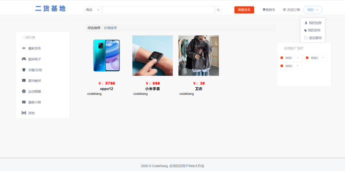
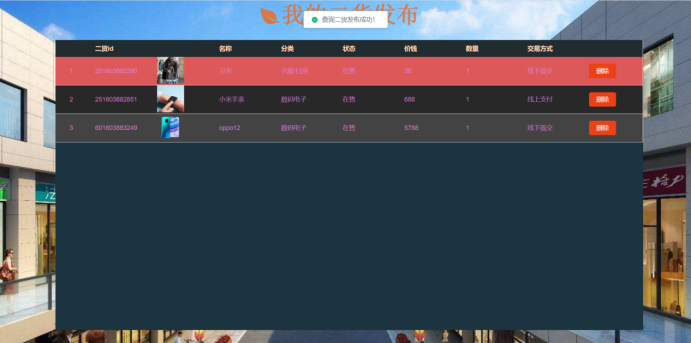
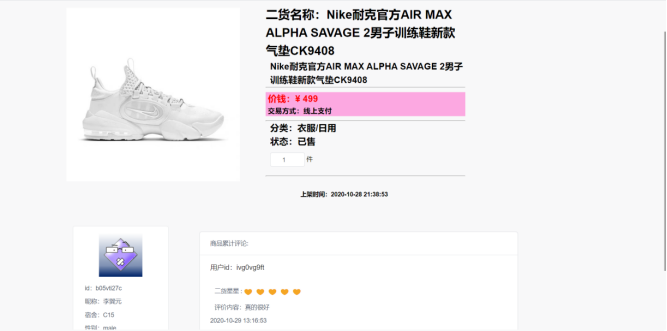
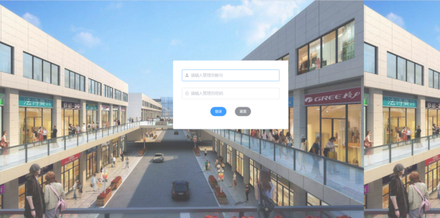
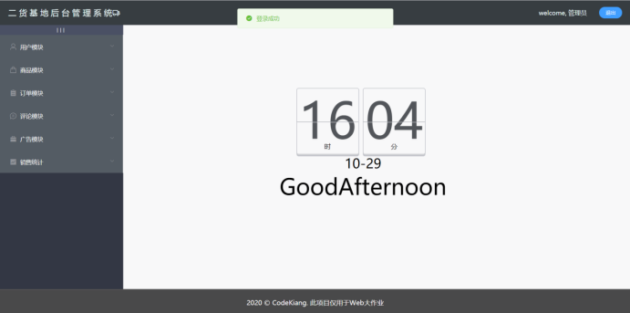
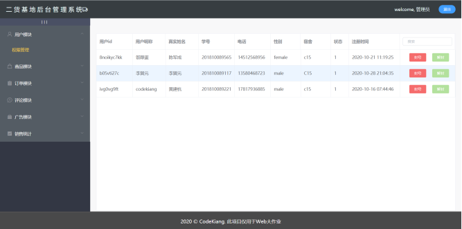
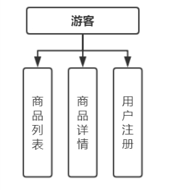
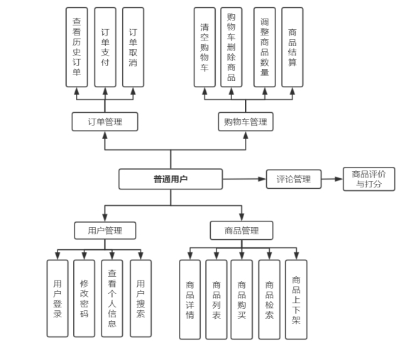
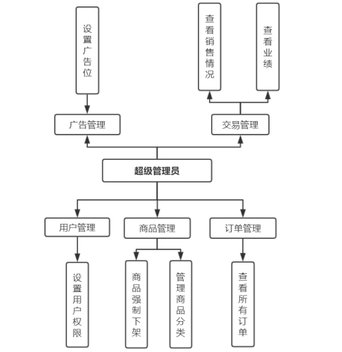
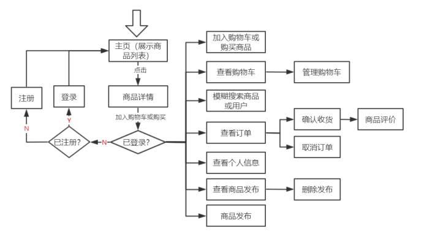

# 效果预览

首页效果图：




我的发布页面效果图：




商品详情页：




管理员登录页：




后台首页：




用户管理：



# 项目结构分析

```
+ back_code  后端代码
|
|
+ front_code  前端代码
	+ erhuoadmin  管理员系统
	+ erhuouser  普通用户系统
+ 建表语句.txt  数据库建表语句
```


## 后端文件结构解析

| 文件夹名称           | 功能                                        |
| -------------------- | ------------------------------------------- |
| Controller           | 存放controller层代码                        |
| dao                  | 存放dao层代码及对应的mapper文件             |
| entity               | 存放实体类文件                              |
| Exception            | 存放自定义异常类，如用户查询、token过期异常 |
| Interception         | 存放拦截器代码，验证token                   |
| Result               | 存放返回对象结果集                          |
| Service              | 存放service层代码与对应接口的实现类         |
| Utils                | 存放工具类，如获取标准化时间和token操作     |
| static / goodsImage  | 项目部署后商品图片存放的位置                |
| Out                  | 项目打成war包后存储位置                     |
| **文件名**           | **功能**                                    |
| jdbc.properties      | 数据库配置文件                              |
| mybatis.xml          | mybatis配置文件                             |
| spring-config.xml    | spring配置文件                              |
| springmvc-config.xml | spring MVC配置文件                          |


## 管理员文件结构解析

| 文件夹名称 | 功能                 |
| ---------- | -------------------- |
| advertise  | 存放广告模块组件     |
| comment    | 存放评论模块组件     |
| consume    | 存放销售模块组件     |
| orders     | 存放订单模块组件     |
| goods      | 存放商品模块组件     |
| user       | 存放用户管理模块组件 |


## 用户文件结构解析

| 文件夹名称      | 功能                                         |
| --------------- | -------------------------------------------- |
| assets          | 存放静态资源，如商品图片，组件背景图等       |
| components      | 存放一些固定组件，如搜索栏、公告栏、侧边栏等 |
| comment         | 存放评论模块组件                             |
| goods           | 存放商品详情页、商品列表等组件               |
| profile         | 存放个人信息、我的发布、购物车和订单组件     |
| user            | 存放购买商品、登录注册以及发布组件           |
| **文件名**      | **功能**                                     |
| router/index.js | 编写路由跳转代码                             |
| store/index.js  | 临时记录商品的某些信息                       |
| http.js         | 对网络请求的封装                             |
| main.js         | 导入项目必要的模块及一些基本配置             |
| vue.config.js   | 对vue项目的一些自定义设置                    |


# 关于项目

## 1.1 开发环境

使用软件：Vscode、Navicat、IDEA、Postman、Tomcat 9.0.31

开发环境：Windows10系统、JDK1.8

使用语言及框架：Vue.js + iView + SSM

使用数据库：Mysql8.17

前端页面访问地址：http://localhost:8080/#/index

管理员系统访问地址：http://localhost:8686/#/

 

## 1.2 需求分析

​		目前处于互联网技术发展时代，许多的各种类型的电子商务类网站纷纷建立，可以很大程度上的解决人们信息资源的闭塞以及地域上的限制。而在大学校园里，很多学生肯定会因为某些原因导致生活物品、优惠券、书籍等等不再能满足自身需求，从而需要转卖。比如出售偏小的衣服。又或者本身对于商品的需求不是很严格，只需要使用一段时间或视情况二用，则其会更想要使用二手的。比如需求二手书。于是就校园二手市场而言，可为大学生提供便捷的交易方式、让资源得到充分的使用。在这个二手市场平台上，每个人可以很方便的发布自己的商品信息，浏览其他人的发布信息，还可以“货比三家”。但是，该系统只是一个交流二手商品信息的平台，与一般的电子商务类网站又有本质的区别。


## 2.1 程序的功能模块

**游客**只能进行查看商品列表、查看商品详情以及注册操作。




**普通用户**可以是卖家也可以是买家，可以对五大模块进行操作。

 


**超级管理员**可以对用户进行封号或解封，查看所有订单以及查看销售情况等。



## 2.2 程序流程图

 

